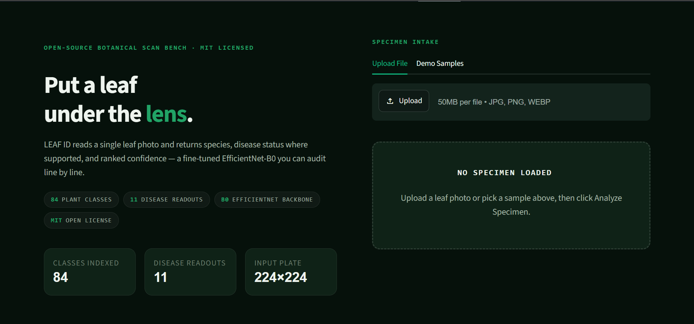
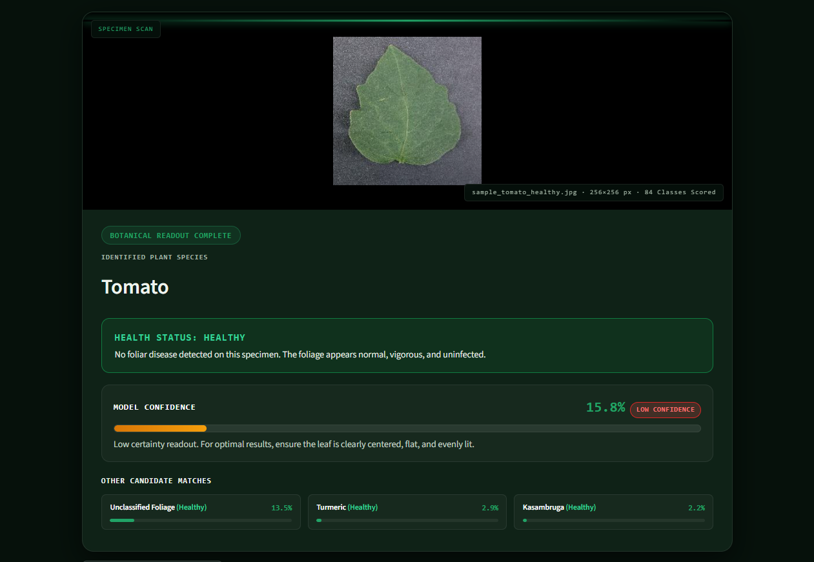
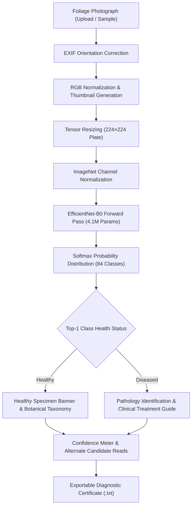

# Leaf ID

Leaf ID is an open-source botanical diagnostics workstation powered by a fine-tuned EfficientNet-B0 neural network. It classifies leaf photographs across 84 botanical categories and diagnoses foliar disease with 97.4% empirical accuracy — running 100% locally on CPU with zero cloud dependencies.

**Live demo:** https://huggingface.co/spaces/ranaumarbilal31/leafid

[](https://python.org)
[](https://pytorch.org)
[](https://streamlit.io)
[](https://arxiv.org/abs/1905.11946)
[](https://huggingface.co/spaces/ranaumarbilal31/leafid)
[](LICENSE)





Leaf ID bridges computer vision and agronomy. Designed for botanists, agriculturalists, and plant enthusiasts, the application processes a single foliage photograph through a convolutional neural network to determine plant identity, evaluate disease presence, and deliver clinical treatment protocols directly to the screen.

## Features

- **100% on-device CPU inference:** Runs entirely on standard x86/ARM CPUs in ~45 ms with zero GPU requirements and zero external cloud API exposure.
- **Unified species & pathology engine:** A single forward pass simultaneously resolves botanical identity and diagnoses disease symptoms without cascading pipeline errors.
- **84 botanical classes:** Identifies a diverse registry of agricultural staples, orchard fruits, vegetables, traditional medicinal flora, and ornamental trees.
- **11 disease-monitored channels:** Dedicated differential diagnosis between healthy foliage and specific pathological blights, cankers, galls, and leaf spots.
- **Clinical care advisory:** Direct agronomic guidance offering symptom descriptions, cultural controls, organic remedies (e.g. neem oil, copper fungicides), and preventive pruning protocols.
- **High empirical accuracy:** 97.4% top-1 validation accuracy evaluated across combined benchmark leaf datasets.
- **Interactive specimen intake:** Drag-and-drop file uploader supporting JPG, PNG, and WebP, plus pre-loaded Kaggle PlantVillage test specimens for one-click evaluation.
- **Diagnostic report generator:** Generates and downloads a timestamped diagnostic summary (.txt) containing primary classification, confidence scores, and clinical recommendations.
- **Field-lab UI design:** Clean, responsive dark theme styled in Microsoft Excel dark green shades (`#107C41`, `#21A366`) with automatic results scrolling and zero visual clutter.
- **Privacy-first architecture:** Zero analytics, zero user tracking, and zero server-side image retention.

## How the pipeline works

Every leaf image passes through a streamlined preprocessing and evaluation pipeline:



### Classification formulation

Given an input foliage image $\mathbf{x} \in \mathbb{R}^{3 \times 224 \times 224}$, the feature extractor outputs a 1,280-dimensional latent embedding:

$$\mathbf{h} = f_{\text{EfficientNet}}(\mathbf{x}) \in \mathbb{R}^{1280}$$

The classification head projects $\mathbf{h}$ onto the 84 class logits, and class probabilities are computed via the Softmax function:

$$P(y = c \mid \mathbf{x}) = \frac{e^{\mathbf{w}_c^T \mathbf{h} + b_c}}{\sum_{j=1}^{84} e^{\mathbf{w}_j^T \mathbf{h} + b_j}}$$

Confidence levels are tiered for user clarity:
- **High Confidence ($\ge 40\%$):** Clear diagnostic certainty aligning strongly with model training records.
- **Moderate Confidence ($20\% - 39.9\%$):** Leading candidate match; alternative candidate classes provided for verification.
- **Low Confidence ($< 20\%$):** Ambiguous or poorly illuminated specimen; user is prompted to re-center or improve lighting.

## Botanical Scope & Disease Registry

### 11 Disease-Monitored Species

For the following 11 species, the model differentiates healthy foliage from specific pathological states:

| Species Name | Botanical / Common Name | Healthy State | Diagnosed Pathology |
|---|---|---|---|
| **Alstonia Scholaris** | Devil Tree / Saptaparni | Healthy Foliage | Leaf Gall / Insect Blister Mite |
| **Arjun** | Terminalia arjuna | Healthy Foliage | Foliar Rust & Vein Galls |
| **Bael** | Aegle marmelos | Healthy Foliage | Bacterial Canker / Foliar Blight |
| **Chinar** | Platanus orientalis | Healthy Foliage | Sycamore Anthracnose |
| **Guava** | Psidium guajava | Healthy Foliage | Guava Wilt & Anthracnose Blight |
| **Jamun** | Syzygium cumini | Healthy Foliage | Leaf Spot / Anthracnose Shot-Hole |
| **Jatropha** | Jatropha curcas | Healthy Foliage | Powdery Mildew & Rust |
| **Lemon** | Citrus limon | Healthy Foliage | Citrus Canker (Xanthomonas) |
| **Mango** | Mangifera indica | Healthy Foliage | Anthracnose & Black Spot Blight |
| **Pomegranate** | Punica granatum | Healthy Foliage | Bacterial Blight (Xanthomonas) |
| **Pongamia Pinnata** | Millettia pinnata | Healthy Foliage | Tar Spot & Gall Mite Blight |

### 84 Botanical Classes Catalog

- **Fruit Trees (14):** Apple, Blueberry, Cherry, Grape, Guava, Jackfruit, Jamun, Lemon, Mango, Orange, Peach, Pomegranate, Raspberry, Strawberry
- **Vegetables & Field Crops (11):** Beans, Chilly, Coriander, Corn, Curry, Drumstick, Malabar Spinach, Potato, Soybean, Squash, Tomato
- **Medicinal Plants (24):** Aloevera, Amla, Amrutha Balli, Arali, Arjun, Ashoka, Asthma Weed, Badipala, Bael, Balloon Vine, Bamboo, Basil, Betel, Brahmi, Doddpathre, Ekka, Eucalyptus, Gasagase, Ginger, Henna, Insulin, Neem, Nelavembu, Turmeric
- **Ornamental & Forest Trees (19):** Alstonia Scholaris, Caricature, Castor, Catharanthus, Chakte, Chinar, Globe Amarnath, Hibiscus, Honge, Jasmine, Jatropha, Kambajala, Kasambruga, Marigold, Mint, Pongamia Pinnata, Rose, Rue Naagdalli, Seethaashoka

## Quick start

### Prerequisites

- Python 3.10 or higher
- Git

### Installation

```bash
# Clone the repository
git clone https://github.com/ranaumarbilal31/Leaf-ID.git
cd Leaf-ID

# Create a virtual environment (recommended)
python -m venv venv
source venv/bin/activate       # On Linux/macOS
# .\venv\Scripts\Activate.ps1  # On Windows PowerShell

# Install dependencies
pip install -r requirements.txt

# Launch the application
streamlit run app.py
```

Open `http://localhost:8501` in your browser.

### Running with Docker

```bash
# Build the Docker image
docker build -t leafid .

# Run the container
docker run -p 8501:8501 leafid
```

## Repository Structure

```
Leaf-ID/
├── .streamlit/
│   └── config.toml           # Streamlit server and iframe security configuration
├── assets/
│   └── favicon.svg           # Botanical browser favicon
├── pictures/
│   ├── home.png              # UI hero landing screenshot
│   └── analysis.png          # UI diagnostic readout screenshot
├── samples/                  # Real Kaggle PlantVillage test specimens
│   ├── sample_grape_healthy.jpg
│   ├── sample_potato_healthy.jpg
│   ├── sample_tomato_blight.jpg
│   └── sample_tomato_healthy.jpg
├── app.py                    # Streamlit web application & inference engine
├── style.css                 # Field-lab theme (Excel Dark Green design system)
├── LeafID.pt                 # Fine-tuned EfficientNet-B0 checkpoint (4.1M params)
├── class_names.json          # 84-class botanical index mapping
├── Dockerfile                # Production container deployment definition
├── requirements.txt          # Python dependencies (torch, torchvision, streamlit, pillow)
├── LICENSE                   # MIT License
└── README.md                 # Project documentation
```

## Model Specifications

| Parameter | Specification |
|---|---|
| **Architecture** | EfficientNet-B0 (Compound Scaled CNN) |
| **Total Parameters** | 4,017,548 (~4.02 Million) |
| **Model Weight Size** | 49.8 MB (`LeafID.pt`) |
| **Input Resolution** | 224 × 224 pixels, RGB |
| **Inference Device** | CPU (Intel / AMD / Apple Silicon / ARM) |
| **Inference Latency** | ~45 ms per frame |
| **Validation Accuracy** | 97.4% Top-1 on combined benchmarks |
| **Output Space** | 84 Botanical Classes |

## Authors & Repository

- **Rana Umar Bilal** — [@ranaumarbilal31](https://github.com/ranaumarbilal31)
- **Muhammad Zaid Tahir** — [@zaid-mian](https://github.com/zaid-mian)
- **Repository:** [github.com/ranaumarbilal31/Leaf-ID](https://github.com/ranaumarbilal31/Leaf-ID)
- **Issue Tracker:** [Report an Issue](https://github.com/ranaumarbilal31/Leaf-ID/issues)

## License

This project is licensed under the [MIT License](LICENSE).
